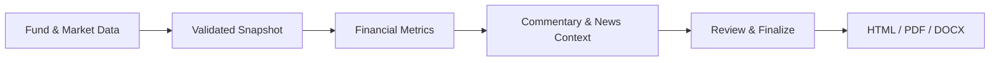

# Fund Commentary Automation

[](https://www.python.org/)
[](https://fastapi.tiangolo.com/)
[](https://react.dev/)
[](https://www.typescriptlang.org/)
[](https://www.mysql.com/)

A full-stack platform for turning fund, benchmark, constituent, and market data into polished monthly investment commentary. It combines a deterministic financial calculation engine with an editorial review workflow and produces consistent HTML, PDF, and DOCX reports from one finalized document version.

The platform is designed around the way fund reporting teams work: select a fund ticker and reporting period, load market data, validate calculated metrics, add market and company context, review the narrative, and publish a controlled final report.

## Financial analytics

The calculation layer keeps report numbers reproducible and traceable. It supports:

- fund and benchmark performance across 1M, 3M, 6M, YTD, and historical periods;
- dividend-adjusted constituent returns using aligned market dates;
- holdings analysis by ticker, portfolio weight, and performance;
- top and bottom performer rankings with deterministic tie-breaking;
- industry and sector exposure aggregation;
- portfolio statistics including AUM, turnover, holdings count, and weight coverage;
- formula versions, source lineage, immutable data snapshots, and quality checks.

Period returns follow the standard total-return relationship:

```text
period_return = ending_value / starting_value - 1
```

Missing observations remain explicit rather than being treated as zero. Reported figures are calculated on the server, bound to their source snapshot, and locked when the report is finalized.

## Reporting workflow



The workspace brings quantitative analysis and editorial work together. Users can review historical performance, examine holdings and sector exposure, connect relevant company news to portfolio names, refine bilingual commentary, and preview the final layout before publication. Finalized reports are versioned and auditable; every download is generated from the approved version.

## Engineering highlights

- **Consistent financial data** — calculations, formatting rules, and quality gates are centralized in the backend.
- **Traceable results** — snapshots, metrics, formulas, report versions, and export events retain clear lineage.
- **Controlled publishing** — role-aware review and finalization prevent unapproved edits from reaching published reports.
- **Multi-format rendering** — one canonical report document drives browser output, print-ready PDF, and editable DOCX.
- **Production-ready architecture** — FastAPI, SQLAlchemy, Alembic, MySQL, React, TypeScript, container images, and Kubernetes manifests.
- **Security by design** — scoped data access, signed downloads, audit events, safe HTML rendering, and configurable identity modes.

## Technology

| Layer | Stack |
| --- | --- |
| Web application | React 18, TypeScript, Webpack Module Federation |
| API and domain services | Python 3.12+, FastAPI, Pydantic v2 |
| Financial calculations | Decimal-based Python domain modules |
| Persistence | SQLAlchemy 2, Alembic, MySQL 8 |
| Documents | Jinja2, Playwright/Chromium, python-docx |
| Testing | Pytest, Vitest, visual regression checks |
| Deployment | Docker, nginx-unprivileged, Kubernetes |

## Quick start

Requirements: Python 3.12+, Node.js 24.19+, npm, and a Chromium installation for local PDF rendering.

```powershell
python -m venv .venv
.\.venv\Scripts\python -m pip install -e ".\backend[dev,render]"
.\.venv\Scripts\python -m playwright install chromium
npm ci

Push-Location backend
..\.venv\Scripts\python -m alembic upgrade head
Pop-Location
```

Start the API:

```powershell
$env:TASK_MODE = "EAGER"
$env:AUTH_MODE = "LOCAL"
.\.venv\Scripts\python -m uvicorn app.main:app --app-dir backend --reload --port 8000
```

Start the web application in a second terminal:

```powershell
npm run dev
```

Open [http://localhost:3030/remote/fund-cmt-auto/](http://localhost:3030/remote/fund-cmt-auto/).

Local development can use SQLite. Deployed environments use MySQL 8 with `utf8mb4`; startup checks reject unsafe production configuration before the API begins serving traffic.

## Verification

```powershell
.\.venv\Scripts\python -m pytest backend/tests
npm test
npm run build
```

The repository also includes migration checks, security boundary tests, financial calculation fixtures, rendering validation, and visual comparison tooling for report output.

## Deployment

The application ships as separate backend and frontend containers. The backend performs synchronous calculations, translation, and document rendering; generated files use isolated temporary directories and are removed after each response. Persistent business data, finalized document versions, and audit records are stored in MySQL.

Deployment manifests and environment examples are available in [`k8s/`](k8s/). See the [deployment guide](k8s/README.md) for UAT and production setup.
