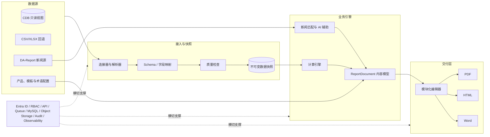
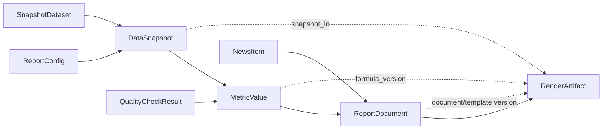

<!-- 本文档用于开发 Agent 执行；版本 V2.1；生成日期 2026-08-06。 -->

AGENT EXECUTION SPECIFICATION

# 月度基金评论报告生成系统

*Agent执行规格书与技术实施蓝图*

版本：V2.1

状态：可用于技术评审、任务拆解和开发Agent执行

日期：2026-08-06

首个用例：3033 / HSTECH - 2026年6月月度评论

主要数据源：CDB只读视图；CSV/XLSX为显式、可审计回退

目标输出：PDF、响应式HTML、可编辑Word

> 执行目标：本文件不是概念性方案，而是开发Agent的目标合同。Agent应按工作包顺序交付代码、数据库迁移、接口、测试、监控、样例数据和验收证据；任何影响金融口径、CDB映射或合规边界的未知项必须进入Decision Log，不得自行编造。

> 结构参考：参考TD Attribution需求文档，将项目目标、拆解框架、计算逻辑、数据源、平台功能和行动项逐层展开，并补充架构、数据契约、任务依赖和Definition of Done。

> V2.1补充：将React + TypeScript前端与Python + FastAPI后端由建议升级为强制架构；新增以`3033 Monthly Commentary - 30 June 2026_LCD.pdf`为权威黄金样例的PDF/HTML/DOCX版式、渲染、跨格式一致性及视觉回归合同。

# 0. Agent执行合同

## 0.1 Agent使命

在不改变业务口径和视觉基准的前提下，建设一个可重复、可审计、可扩展的月度基金评论报告平台。平台以CDB快照为生产事实来源，支持人工可控的内容编辑、新闻筛选和AI辅助，并从同一终稿内容模型生成PDF、HTML和Word。

## 0.2 权威来源与冲突优先级

| 优先级 | 权威来源 | 冲突处理 |
| --- | --- | --- |
| 1 | 本文件中已确认的业务规则与验收标准 | 直接执行；变更必须留Decision Log |
| 2 | CDB数据所有者确认的字段契约、日历与代码映射 | 以书面确认或版本化配置为准 |
| 3 | 3033 Monthly Commentary视觉与内容样例 | 控制模块顺序、品牌和版式基准 |
| 4 | 实际CSV/XLSX样例 | 用于解析器、回归样例与字段映射 |
| 5 | 本文标注为建议或待确认的技术选型 | Agent可实现可替换适配层，但不得固化未知业务假设 |

## 0.3 不可违反的执行规则

- 不得在模板、前端或渲染器中硬编码报告数字、日期、证券名称、行业或脚注；全部来自快照、派生指标或版本化配置。

- 不得把AI生成的数字作为计算结果；AI只能引用系统生成的MetricValue，并必须完成数字回查。

- 不得隐式混合CDB与上传文件。同一数据集只能选择一个生效来源；覆盖动作必须记录原因、操作者和差异。

- 不得覆盖旧快照、旧终稿或旧成品。刷新、修改和重新渲染均创建新版本并保留血缘。

- CDB账号、访问令牌、签名URL和付费新闻正文不得进入日志、提示词、代码库或成品。

- 每个工作包必须同时交付实现、自动测试、迁移/配置、运行说明、监控点和可复核验收证据。

## 0.4 Definition of Ready / Definition of Done

| 门槛 | Agent开始/结束条件 |
| --- | --- |
| Ready | 业务口径已给出；至少一份脱敏样例可用；字段映射或待确认项已登记；依赖工作包通过；验收数据和期望结果可计算。 |
| Done | 代码合并；迁移可回滚；单元/集成/契约/权限测试通过；日志和指标可见；文档更新；3033黄金样例通过；无阻断性质量检查。 |
| 禁止假完成 | 仅完成页面、仅返回模拟数据、仅能在开发机运行、缺少来源血缘、存在硬编码数字、视觉渲染未核验，均不得标记Done。 |

## 0.5 必须暂停并升级的条件

- 同一业务指标存在两个不能等价转换的定义，且会改变对外数字。

- CDB视图或字段无法稳定识别证券、指数、基金、日期、币种或总回报序列。

- 参考报告与样例数据无法对账，误差超过本文件容差，且无可解释来源。

- 需要新增外部付费数据源、对外发布权限、个人数据处理或超出既定网络边界。

- 需要破坏旧版本、降低审计粒度或绕过阻断性质量检查才能继续。

## 0.6 文档导航

| 章节 | 用途 |
| --- | --- |
| 1-3 | 目标、范围、报告模块拆解 |
| 4-6 | 架构、数据源、数据模型与链路 |
| 7-9 | 计算口径、平台功能、接口与状态机 |
| 10-12 | 安全与非功能、测试验收、运维发布 |
| 13-15 | Agent工作包、行动项、风险与最终交付 |
| 附录 | 字段字典、接口样例、可复制Agent启动提示和检查清单 |

# 1. 项目背景、目标与成功标准

## 1.1 当前问题

- 月报内容横跨CDB、CSV/XLSX、行业分类文件、新闻和人工文案，采集与对账链路分散。

- 现有流程依赖Excel、PowerPoint和手工复制，容易产生日期、脚注、排序、精度和版本不一致。

- PDF、HTML和Word如果分别制作，会出现三份事实来源和不可追踪的人工修改。

- 新闻与Month in Review需要编辑自由度，但任何数字必须保持可回查与可审计。

- 产品扩展后，模板复制与人工校验成本近似按产品数量线性增长。

## 1.2 项目目标

| 编号 | 目标 | 交付结果 | 成功证据 |
| --- | --- | --- | --- |
| OBJ-01 | 数据自动化 | 从CDB按产品与报告日生成版本化快照；上传文件仅作显式回退 | 快照可重放；所有数字可定位到来源行/公式 |
| OBJ-02 | 模块化生产 | 按参考PDF模块组织数据、计算、编辑、新闻和最终分析 | 3033样例模块完整，顺序和脚注一致 |
| OBJ-03 | 自由编辑 | Month in Review支持12列网格、拖拽、1/2/3栏和富文本 | 不写CSS即可完成常见版式 |
| OBJ-04 | 确定性计算 | 统一计算历史表现、成份股、行业、Top/Bottom和组合指标 | 黄金样例误差在规定容差内 |
| OBJ-05 | 三格式同源 | 从Finalized ReportDocument生成PDF、HTML和Word | 三格式数据、文字、新闻顺序和模块顺序一致 |
| OBJ-06 | 企业级治理 | 实现Entra、RBAC、审计、版本、监控、备份和恢复 | 权限、审计、RPO/RTO测试通过 |

## 1.3 成功指标

| 维度 | 指标 | 目标 |
| --- | --- | --- |
| 效率 | 单产品从快照到三格式成品的人工操作时间 | 较当前基线减少至少70%；基线在Discovery阶段记录 |
| 质量 | 阻断性数据错误进入终稿 | 0 |
| 一致性 | 三格式数字/文本/模块差异 | 0个未授权差异 |
| 可追溯 | 对外数字具备来源、期间和公式版本 | 100% |
| 性能 | 快照P95 / 单格式渲染P95 | ≤30秒 / ≤60秒 |
| 可用性 | 月报窗口服务可用性 | ≥99.5%，计划维护除外 |
| 复用 | 新增产品仅需配置而无需复制业务代码 | 首批支持至少5个产品/基准组合 |

## 1.4 首期范围与非目标

| 首期包含 | 首期不包含 |
| --- | --- |
| 报告中心、产品配置、CDB快照、上传回退、质量检查 | 用系统替代CDB/PMA/指数供应商的源系统职责 |
| 六大报告模块、AI辅助初稿、人工编辑和版本控制 | 让AI独立计算金融指标或自动终稿化 |
| PDF、HTML、Word生成、存储、下载和在线只读HTML | 任意自由设计工具、通用CMS或完整桌面排版软件 |
| 3033/HSTECH黄金样例及可配置扩展 | 首期覆盖所有基金类型的特殊投资策略分析 |

# 2. 用户、职责、范围与业务流程

## 2.1 角色与权限

| 角色 | 核心职责 | 关键权限 |
| --- | --- | --- |
| Report Editor | 创建月报、选择快照、编辑文案/新闻/布局、发起终稿 | 读授权产品；编辑草稿；预览；不可改计算结果 |
| Reviewer | 复核数字、新闻、脚注与版式 | 比较版本；查看血缘；记录复核结论 |
| Product Admin | 维护产品、基准、CDB映射、模板、术语和有效期 | 配置管理；不能篡改终稿快照 |
| Data Steward | 确认字段契约、覆盖范围、异常和回退 | 查看数据差异；批准例外原因 |
| Platform Admin | 用户组、新闻源、系统参数、任务与监控 | 平台运维；无默认业务终稿权限 |
| Auditor | 读取终稿、快照、来源、版本和操作记录 | 只读；禁止编辑与重新渲染 |

## 2.2 RACI

| 活动 | Business | Data | IT/Agent | Risk/Compliance |
| --- | --- | --- | --- | --- |
| 业务口径与文案 | A/R | C | C | C |
| CDB字段与数据质量 | C | A/R | R | I |
| 计算引擎与接口 | C | C | A/R | I |
| 新闻来源与AI政策 | R | I | R | A/C |
| 终稿与发布 | A/R | C | I | C |
| 安全、审计与运维 | I | C | A/R | C |

## 2.3 报告生命周期

| 状态 | 进入条件 | 允许动作 | 退出条件 |
| --- | --- | --- | --- |
| DRAFT | 报告参数已创建 | 选择来源、刷新快照、编辑配置 | 形成有效快照 |
| DATA_READY | 全部阻断性数据检查通过 | 计算、生成AI初稿、选择新闻 | 进入编辑 |
| EDITING | 内容模型已建立 | 编辑、拖拽、预览、保存版本 | 内容与质量检查完成 |
| QA_BLOCKED | 出现阻断性数据/渲染/数字回查错误 | 修复、换快照、重算 | 所有阻断项关闭 |
| READY_TO_FINALIZE | 数字、内容、来源和预览均通过 | 终稿化 | 生成不可变终稿 |
| FINALIZED | 终稿版本和绑定快照锁定 | 生成/重试成品；禁止直接编辑 | 发布或创建修订版 |
| ARCHIVED | 保留期或手工归档 | 只读与审计 | 仅管理员恢复读取状态 |

## 2.4 端到端业务步骤

1. 选择产品、报告月份、截止日、语言、模板和输出格式。

1. 从CDB生成不可变数据快照；若数据不可用，用户按数据集选择上传回退并填写原因。

1. 运行Schema、覆盖率、日期、权重、证券唯一性、历史深度和来源新鲜度检查。

1. 计算历史表现、成份股表现、行业、Top/Bottom、Top 10和组合指标，并保存公式版本与中间结果。

1. 抓取并规范化公司新闻；完成去重、成份股匹配、AI摘要和人工筛选。

1. 生成Month in Review初稿；编辑器进行文字、布局、新闻和说明调整。

1. 预览PDF分页、HTML桌面/移动和Word结构；数字回查与渲染完整性通过。

1. 终稿化后锁定ReportDocument与DataSnapshot，异步生成三格式成品。

1. 发布、下载、归档；任何修订必须从终稿复制出新版本。

# 3. 参考报告拆解框架

## 3.1 模块边界

| ID | 模块 | 业务内容 | 系统来源 |
| --- | --- | --- | --- |
| M1 | Month in Review | 网格布局、富文本、关键驱动/关注点、AI辅助 | 编辑器 + AI服务 + MetricValue |
| M2 | Historical Performance | 基金与基准1M/3M/6M/YTD表现 | 总回报序列 + 计算引擎 |
| M3 | Company News | 成份股新闻抓取、去重、摘要、选择、来源 | DA-Report适配器 + Azure OpenAI |
| M4 | Constituents Performance | 成份股代码、名称、价格、权重和多周期回报 | 成份股快照 + 总回报序列 |
| M5 | Final Analytics | Top 10、行业、Top/Bottom、Portfolio Analysis | 汇总计算 + 基金KPI |
| M6 | Footnotes & Disclosures | 数据日期、定义、来源、免责声明、N/A原因 | 规则引擎 + 版本化模板 |

## 3.2 页面/区块拆分规则

- 系统以Section → GridRow → Block组织内容，不把参考PDF页码硬编码为固定页；PDF分页由版式规则和内容高度决定。

- 每个Block具有稳定block_id、类型、语言字段、数据绑定、样式令牌、来源和版本；复制/拖拽不改变数据血缘。

- 图表、表格和脚注使用数据绑定，标题和说明可人工编辑；计算值不可在富文本中直接覆盖。

- 若模块因产品不适用而隐藏，系统保留不适用原因，不生成空白标题或空表。

## 3.3 关键模块依赖

| 模块 | 前置依赖 | 阻断条件 |
| --- | --- | --- |
| Historical Performance | 基金/基准官方总回报序列、交易日历、报告日 | 起止点缺失、序列类型不一致、币种不明 |
| Company News | 有效成份股快照、新闻源、公司别名表 | 无来源URL、无法匹配主体、新闻日期越界 |
| Constituents | 同一as_of成份股、价格/回报、证券主数据 | 证券重复、权重异常、日期不一致 |
| Sector/Top/Bottom | 成份股与版本化HSICS映射 | 缺行业、权重合计失败、回报不足 |
| Portfolio Analysis | AUM、日成交额、最终成份股集合 | 单位/币种不明、覆盖率不足 |
| Month in Review | 已计算指标、已选新闻、用户提示 | AI引用数字无法回查 |

# 4. 架构设计

## 4.1 架构原则

- 单一事实来源：报告只绑定一个active_snapshot；终稿绑定该快照并保持不可变。

- 控制面与数据面分离：产品/模板/权限属于控制面，快照/计算/内容/成品属于数据面。

- 同步命令、异步重任务：配置与编辑走同步API；CDB快照、新闻、AI和渲染通过任务队列。

- 适配器隔离外部系统：CDB、上传文件、新闻、AI和渲染均通过稳定接口接入，物理实现可替换。

- 可重放与幂等：同一输入、参数、公式版本和模板版本应产生相同计算结果与可识别成品。

- 安全默认：最小权限、私网访问、短期签名URL、敏感信息不进入AI与日志。



图1：推荐逻辑架构。箭头表示主数据流；平台基础能力横跨所有业务模块。

## 4.2 组件职责

| 组件 | 职责 | 实现边界/建议 |
| --- | --- | --- |
| Web App | 报告中心、数据工作台、编辑器、新闻选择、预览、终稿和管理 | React/TypeScript；仅调用业务API |
| Business API | 鉴权、报告/快照/内容/版本/权限/下载编排 | FastAPI；不执行长耗时任务 |
| Connector Service | CDB只读查询、上传解析、字段映射、快照落库 | 连接器按数据集隔离 |
| Calculation Engine | 期间、总回报、排名、行业汇总、组合指标、脚注 | 纯函数优先；公式版本化 |
| News Service | 抓取、规范化、去重、公司匹配、摘要与候选库 | 复用DA-Report逻辑但通过适配层接入 |
| Content/AI Service | Month in Review初稿、数字引用、术语和双语辅助 | Azure OpenAI；强制MetricValue引用 |
| Render Service | 同一终稿模型生成PDF/HTML/DOCX并执行完整性检查 | 模板/字体/渲染器版本化 |
| Worker/Queue | 执行快照、计算、新闻、AI、渲染和重试 | Celery + Redis建议基线 |
| Application DB | 元数据、快照索引、计算结果、内容、版本、审计 | MySQL 8建议基线 |
| Object Storage | 上传原件、快照大文件、图像、成品和渲染证据 | 公司TOS/S3兼容存储 |

## 4.3 数据传输链路

| 链路 | 协议/载荷 | 控制 |
| --- | --- | --- |
| Browser → API | HTTPS JSON；Entra令牌；乐观锁version；request_id | 禁止把大文件经业务API多次转发 |
| Browser → Object Storage | API签发短期预签名URL后直传；完成后回调登记 | 文件扩展名、MIME、大小、病毒和内容检查 |
| API/Worker → CDB | 私网TLS数据库连接；只读账号；参数化SQL；连接池与超时 | 按产品、日期和视图白名单查询 |
| API → Queue | 仅传job_id/report_id/snapshot_id，不传敏感大对象 | 幂等键阻止重复任务 |
| Worker → Azure OpenAI | 最小化文本、新闻元数据和已计算指标引用 | 不发送CDB凭证、原始受限字段或付费全文 |
| Worker → Storage | 分块写入成品；完成后计算SHA-256并登记元数据 | 失败文件不可标记可下载 |
| Web → Job Status | 轮询或SSE/WebSocket读取状态和进度 | 断线不影响后台任务 |

## 4.4 部署拓扑与环境

| 区域 | 部署要求 |
| --- | --- |
| DEV | 允许脱敏样例与模拟连接器；独立数据库/存储；AI与新闻调用限额；不访问生产凭证。 |
| UAT | 访问受控的CDB UAT/只读数据；运行3033黄金样例；用户验收与视觉回归。 |
| PROD | Kubernetes或公司标准容器平台；私网访问CDB；多副本API/Worker；密钥托管；集中日志监控。 |
| 隔离 | 数据库、Redis、对象存储前缀、Entra应用、密钥和域名按环境隔离；禁止共享生产写权限。 |
| 发布 | 镜像不可变；数据库迁移前向兼容；蓝绿/滚动发布；失败自动回滚到上一镜像。 |

## 4.5 强制技术基线（不得替换）

| 层 | 强制实现 | 执行约束 |
| --- | --- | --- |
| 前端 | React + TypeScript；建议Vite、Ant Design、TipTap、dnd-kit、ECharts | React是唯一前端框架；禁止以服务端模板、Vue、Angular或纯静态页面替代产品前端；必须保留12列网格、数据绑定、所见即所得预览和无障碍契约 |
| 后端 | Python 3.12+ + FastAPI + Pydantic v2 + SQLAlchemy 2 + Alembic | FastAPI是唯一业务后端框架；必须输出OpenAPI、执行类型校验、数据库迁移、鉴权和审计钩子；禁止在React客户端实现权威业务计算 |
| 任务 | Celery + Redis | 至少支持幂等、重试、超时、取消、进度和死信分析 |
| 数据 | MySQL 8 + 公司对象存储 | 应用库不得替代CDB；成品与原件不可依赖容器本地盘 |
| 渲染 | Python Jinja2生成规范HTML/CSS；Playwright/Chromium或经批准的等价HTML-to-PDF引擎；python-docx | 三种格式共同读取同一个Finalized ReportDocument和DesignToken版本；PDF不得由截图拼接；DOCX不得由PDF转换 |
| 身份 | Microsoft Entra ID | 组映射、最小权限、服务身份和下载授权 |
| 监控 | OpenTelemetry + 公司日志/指标平台 | request_id/job_id/report_id全链路关联 |

### 4.5.1 前后端边界

- React只负责交互、编辑、可视化、预览与任务状态展示；不得持有CDB凭证，不得绕过FastAPI直连数据库或对象存储（预签名上传/下载除外）。

- FastAPI负责鉴权、RBAC、业务校验、报告/快照/版本编排、签名URL和任务提交；所有公开接口位于`/api/v1`并由OpenAPI契约驱动生成前端类型。

- 计算、AI、新闻抓取和渲染为Python Worker任务；API响应不等待重渲染完成，前端通过SSE或轮询读取进度。

- React预览必须调用与最终输出相同的规范HTML资产或渲染预览端点，不得维护第二套近似CSS。

## 4.6 3033视觉基准与跨格式渲染合同

### 4.6.1 权威基准与优先级

- 视觉黄金样例为`3033 Monthly Commentary - 30 June 2026_LCD.pdf`，基准ID为`3033_LCD_20260630`，共4页。其页面结构、信息层级、留白、颜色、表格、图表、页眉、页脚和分页是首期输出的权威视觉合同。

- 优先级为：已批准的产品模板覆盖项 > 本节明确数值 > 黄金样例可测量属性 > 通用DesignToken。Agent不得凭个人审美改变版式。

- 必须保存黄金PDF、逐页PNG、页面文本/字体分析、SHA-256、渲染环境和批准记录；若更换黄金样例或容差，必须新建模板版本和ADR，不得覆盖旧基线。

### 4.6.2 页面级DesignToken

| 项目 | 强制规则 |
| --- | --- |
| 页面 | A4纵向，595.2 x 841.92 pt（210 x 297 mm）；首期3033固定4页；不得自动改为Letter或横向 |
| 安全区 | 内容不得进入页脚Logo/页码区；所有页保持一致左右边界和顶部基线；精确边距从黄金PDF测量后写入`backend/app/rendering/tokens/3033-v1.json`，不得散落为代码常量 |
| 字体 | 主字体Calibri；标题使用Calibri Bold；若部署环境无授权字体，必须嵌入批准的字体文件或使用经Marketing书面批准且完成新视觉基线的替代字体；禁止静默回退 |
| 字号 | 以黄金样例为准：报告主标题约24 pt；页面/模块标题约14-16 pt；表头/小标题约10-12 pt；正文约10-11 pt；脚注约8 pt。最终精确值进入DesignToken |
| 品牌色 | 深蓝约`#22327F`（黄金PDF文本主蓝）与表头蓝约`#2660AD`（黄金PDF矩形填充色）；正文黑色；Logo保持原始比例与清晰度。精确RGB从批准资产/黄金样例固化 |
| 线条与表格 | 页眉下方蓝色分隔线；蓝底表头配白字；细分隔线宽度、行高、内边距和列宽必须模板化；数字列右对齐并按规定小数位展示 |
| 页眉 | 每页显示`Monthly Commentary | {MMMM D, YYYY}`，位置、字号、颜色和分隔线与黄金样例一致 |
| 页脚 | 每页右下显示批准的CSOP Logo及页码1-4；Logo不得拉伸、模糊、变色或被内容遮挡 |
| 图表 | 使用矢量SVG或打印分辨率不低于300 dpi的图片；环形图色板、图例顺序、标签与黄金样例一致；不得截屏ECharts画布作为低清成品 |
| 数值 | 百分比、千分位、负号、币种、日期和N/A规则跨PDF/HTML/DOCX一致；不允许由各渲染器二次计算 |

### 4.6.3 固定四页模板

| 页 | 必须包含 | 布局约束 |
| --- | --- | --- |
| 1 | 产品主标题、`June in Review`、正文、左右双栏（Key Drivers / Key Areas to Monitor + Outlook）、Historical Performance表及脚注 | 主标题仅第一页出现；双栏顺序和宽度与黄金样例一致；历史表现表不得跨页 |
| 2 | Company News | 按项目符号排列；新闻标题为蓝色粗体，正文为黑色；一条新闻不可出现标题孤行；内容量超限时必须阻断并提示编辑，不得缩小到最低字号以下 |
| 3 | HSTECH成份股表现标题、再平衡日期、30行成份股表、来源与期间脚注 | 表头蓝底白字；30行保持同页；股票代码列蓝底白字；列宽和小数位固定；若行数不是30或溢出则QC阻断 |
| 4 | Top 10、行业环形图、Top/Bottom Performers、3033.HK Portfolio Analysis及脚注 | 上部两栏、中央两栏、下部整行；图例与数据不得遮挡；分析表保持三行且不跨页 |

### 4.6.4 HTML合同

- 输出为语义化HTML5，使用CSS变量承载同一DesignToken；桌面阅读版可响应式重排，但`@media print`必须严格恢复A4四页结构和黄金样例分页。

- 发布包必须可离线打开：本地化CSS、字体、Logo和图表资源，禁止依赖CDN、运行时API或外部字体；资源使用相对路径或内嵌方式并通过内容安全检查。

- 每一页使用明确的`.report-page`容器和稳定的`data-section-key`；打印时设置`@page { size: A4 portrait; }`、页间强制分页、背景色打印和孤行控制。

- 支持Chrome/Edge当前企业版本；在1280 px及1440 px桌面宽度无横向滚动，在375 px移动宽度可读且表格提供可访问的横向滚动，不以压缩字号隐藏内容。

### 4.6.5 PDF合同

- PDF必须由规范HTML/CSS在版本锁定的无头Chromium（或经批准的等价引擎）打印生成，并记录浏览器、操作系统、字体、模板、DesignToken和渲染器版本。

- PDF必须为4页A4纵向，字体嵌入、文本可选择/搜索、链接可点击、Logo清晰；不得栅格化整页，不得含空白附加页、裁切、重叠、缺字、黑块或不可见文字。

- 元数据至少包含Title、Author、Subject、report_id、template_version、rendered_at；成品写入SHA-256并与终稿版本绑定。

### 4.6.6 Word合同

- DOCX与PDF共享内容、DesignToken和模块顺序；正文、新闻、表格、标题及脚注必须可编辑，不得把整页或表格转为图片。

- 页面设为A4纵向并配置页眉、页脚、Logo、页码、固定列宽、单元格内边距、段前后距、孤行控制和表格行不跨页。图表可使用高分辨率图片，但必须附替代文字和数据来源。

- Word因排版引擎差异可与PDF存在轻微字距/换行差异，但内容、数值、顺序、品牌层级必须一致；以Microsoft Word转PDF后的视觉回归结果作为验收证据。

### 4.6.7 单一渲染源与禁止事项

- 三格式只能读取同一`Finalized ReportDocument`、`template_version`、`design_token_version`和已批准资产清单；渲染器不得各自维护文案、数据查询或业务公式。

- 禁止硬编码`June 30, 2026`、3033、30只成份股或新闻内容；黄金样例值仅存在于fixture，模板使用字段绑定。

- 禁止以调小全局字号、压扁Logo、裁掉脚注、隐藏溢出、截断新闻或删除成份股的方式通过视觉测试；发生溢出必须返回结构化错误并由编辑者处理。

# 5. 数据源概览与数据契约

## 5.1 来源目录

| ID | 数据集 | 来源 | 最小内容 | 用途 |
| --- | --- | --- | --- | --- |
| DS-01 | 产品与基准主数据 | CDB/产品配置 | 产品代码、名称、ticker、基准、币种、时区、有效期 | 生产必须 |
| DS-02 | 官方总回报序列 | CDB | instrument_code、trade_date、total_return_value、series_type | 生产必须 |
| DS-03 | 指数成份股快照 | CDB；CSV/XLSX回退 | as_of、证券标识、名称、价格、权重、行业、币种 | 生产必须 |
| DS-04 | 证券主数据 | CDB | 证券代码、ticker、别名、上市地、币种、有效期 | 生产必须 |
| DS-05 | HSICS行业分类 | CDB；B_HSICSe Industry Code 1.xlsx参考 | 行业/板块/子行业代码与名称、版本有效期 | 生产必须 |
| DS-06 | 基金KPI | CDB | AUM、每日成交额及币种、产品代码、日期 | Portfolio Analysis |
| DS-07 | 指数事件/交易日历 | CDB/指数数据 | 再平衡日、公告日、生效日、交易日 | 脚注与期间规则 |
| DS-08 | 公司新闻 | DA-Report新闻适配器 | URL、来源、发布时间、标题、正文摘要、抓取时间 | 新闻模块 |
| DS-09 | 模板/术语/免责声明 | 应用配置库 | 语言、品牌、模板版本、法律文本、有效期 | 控制面 |

## 5.2 现有样例文件观察结果

> 样例定位：以下样例用于字段映射和黄金回归，不代表生产来源。生产路径仍以CDB版本化只读视图为准。

| 样例 | 范围 | Agent应提取的契约 |
| --- | --- | --- |
| BBG-hstech constituent monthly update (version 1).xlsx | Sheet1 A1:I31；30只成份股 | Code、Ticker、英文/中文名、Weighting、GICS层级 |
| 同上 Formula sheet | A1:O36 | 1M/3M/6M/YTD回报、截止日期、ticker与中英文名称映射 |
| HSTECH_eod_con_20260630.csv | A1:AE31；30只成份股 | Prod Dt、Tradate、Idx Cde、SEDOL、价格、FAF、CF、指数市值、Pct Idx Wgt等31列 |
| B_HSICSe Industry Code 1.xlsx | 9个工作表；All表为汇总 | Industry/Sector/Subsector代码、英文名称、中文行业、Definition与版本说明 |
| 3033 Monthly Commentary PDF/PPTX | 视觉和内容基准 | 模块顺序、标题、表格、图表、脚注、品牌和分页 |
| DA-Report | 新闻实现参考 | 抓取、规范化、公司匹配、摘要和多格式渲染的适配参考 |

## 5.3 CDB逻辑视图契约

| 逻辑数据集 | 必要字段 | 硬性约束 |
| --- | --- | --- |
| product_master | product_code, ticker, name_en, name_zh_hant, benchmark_code, currency, timezone, valid_from, valid_to | 产品与基准一一映射；日期有效 |
| total_return_series | instrument_code, trade_date, total_return_value, series_type, currency, source, updated_at | series_type必须为官方Total Return |
| constituent_snapshot | index_code, as_of_date, security_code, ticker, names, close_price, currency, weight, industry_code | index+date+security唯一；weight单位明确 |
| security_master | security_code, ticker, sedol, names, aliases, exchange, currency, valid_from, valid_to | 支持新闻主体和上传代码映射 |
| industry_master | taxonomy, version, industry_code, parent_code, level, names, valid_from, valid_to | 按报告日选择有效HSICS版本 |
| fund_kpi_daily | product_code, as_of_date, aum, aum_currency, daily_turnover, turnover_currency, source | AUM与成交额单位/币种不可缺 |
| index_event | index_code, event_type, announcement_date, effective_date, source | 用于下一次再平衡日与脚注 |

> 实现要求：物理视图名由部署配置映射，不写入业务代码。Connector启动时执行字段存在性和类型契约检查；契约变化必须阻止生产刷新并告警。

## 5.4 CSV/XLSX回退映射

| 样例列 | 规范字段 | 转换/校验 | 要求 |
| --- | --- | --- | --- |
| Prod Dt / Tradate | as_of_date / trade_date | YYYYMMDD转日期；两者不一致时阻断 | 必填 |
| Idx Cde | index_code | 去空格、大写；与报告基准匹配 | 必填 |
| Lcal Cde / Code | security_code | 保留原始值；映射至security_master | 必填 |
| Ticker | ticker | 规范市场后缀与空格 | 可映射 |
| Stk Name_E/TC/SC | name_en/name_zh_hant/name_zh_hans | Unicode规范化；保留原始文本 | 至少一项 |
| Cls Price | close_price | Decimal；>0；记录币种 | 成份股表必填 |
| Pct Idx Wgt / Weighting | weight | 识别百分数单位；规范为0-1；合计校验 | 必填 |
| Industry / Sector | source_industry_code | 通过版本化HSICS映射到顶级行业 | 必填或可补映射 |
| 1M/3M/6M/YTD return | constituent_period_return | 识别百分数单位；保存期间起止日 | 若上传回报表则必填 |

## 5.5 来源优先级与覆盖规则

- 默认：CDB为生产来源；只有CDB不可用、缺数或业务批准的修正场景允许上传覆盖。

- 覆盖粒度是数据集，不允许同一constituent_snapshot中部分证券来自CDB、部分来自上传。

- 覆盖前必须展示新增、删除、字段变化、权重差异、日期差异和影响模块；用户填写原因。

- 上传覆盖生成独立SnapshotDataset，保留原文件SHA-256、文件名、上传人、解析器版本和验证结果。

- 刷新只创建新快照；旧报告继续绑定旧快照，除非用户显式创建修订版并切换。

## 5.6 新鲜度、覆盖率与责任

| 数据集 | 目标新鲜度 | 最低覆盖 | 异常行为 |
| --- | --- | --- | --- |
| 总回报序列 | 报告截止日最近交易日 | 期间内所有交易日；起止点存在 | 缺起止点阻断；中间缺口阻断 |
| 成份股 | 报告截止日/最近有效指数日 | 全部生效成份股 | 证券重复、权重不平或日期错配阻断 |
| 行业映射 | 报告日有效版本 | 100%有效成份股 | 缺失阻断行业图和终稿 |
| AUM | 报告截止日 | 单点 | 缺失时Portfolio Analysis阻断或经批准隐藏 |
| 每日成交额 | 整个月交易日 | ≥95%交易日 | 低于95%阻断；缺一天显示覆盖率警告 |
| 新闻 | 报告月及允许回溯窗口 | 候选集不设硬数量 | 源不可用告警；人工可补URL |

# 6. 核心数据模型、快照与血缘



图2：从报告配置到成品的不可变血缘。任何成品都能追溯至快照、公式和内容版本。

## 6.1 核心对象

| 对象 | 关键属性 |
| --- | --- |
| Product | 产品、基准、币种、时区、默认模板、CDB映射、有效期 |
| Report | 产品、月份、截止日、语言、状态、修订号、active_snapshot_id |
| DataSnapshot | 来源组合、查询参数、as_of、checksum、创建人、验证状态 |
| SnapshotDataset | 数据集类型、来源、行数、覆盖率、原件、解析器/映射版本 |
| MetricValue | metric_code、value、unit、period_start/end、formula_version、lineage |
| ConstituentSnapshot | 证券、名称、价格、币种、权重、行业、多周期回报 |
| NewsItem | 来源、URL、时间、标题、摘要、主体、重要度、AI元数据 |
| ReportDocument | sections、grid_rows、blocks、语言内容、data_binding、style_token |
| RenderJob | 格式、语言、状态、进度、幂等键、错误码、重试次数 |
| RenderArtifact | storage_key、MIME、bytes、checksum、模板/渲染器版本 |
| QualityCheckResult | 检查ID、严重度、实体、实际值、阈值、状态、修复提示 |
| AuditEvent | actor、action、entity、before/after版本、request_id、时间、IP |

## 6.2 版本与不可变规则

- DataSnapshot在VALID后不可修改；重新查询、上传覆盖或字段映射变化均生成新snapshot_id。

- MetricValue按snapshot_id + metric_code + 期间 + formula_version唯一，禁止无版本覆盖。

- ReportDocument保存完整版本；自动保存可合并短时间内变化，但终稿前必须形成明确版本号。

- FINALIZED版本锁定snapshot_id、document_version、template_version和renderer_version。

- RenderArtifact重新生成时若输入完全相同，应复用或生成可比较的新artifact revision；旧文件不删除。

## 6.3 血缘最小字段

```text
lineage = {
  source_system, dataset_type, source_object, source_record_key,
  snapshot_id, snapshot_dataset_id, as_of_date, extracted_at,
  parser_version, mapping_version, formula_version,
  input_metric_codes[], input_record_keys[], checksum
}
```

## 6.4 数据保留

| 对象 | 建议保留 | 删除/归档规则 |
| --- | --- | --- |
| 上传原件、快照、终稿、成品 | 至少7年或公司政策要求 | 对象锁/版本控制；需审批的生命周期策略 |
| 草稿版本 | 至少1年 | 仅删除无终稿关联且超过策略期限的版本 |
| 任务日志 | 90-180天在线，后归档 | 禁止包含凭证和付费全文 |
| 审计事件 | 至少7年 | 仅追加；不可由业务用户删除 |
| 新闻正文缓存 | 按授权条款 | 默认只保留必要摘要、标题、URL和抓取证据 |

# 7. 计算引擎与质量规则

## 7.1 通用约定

- 所有计算使用Decimal或等价高精度类型；数据库保存原始精度，展示层才四舍五入。

- 收益统一使用官方Total Return序列；基金与基准必须使用相同起止日、币种定义和序列类型。

- 业务时区为Asia/Hong_Kong；报告日若非交易日，使用不晚于报告日的最近有效交易日。

- N/A与0严格区分：N/A表示数据不足/不适用，0表示已计算且结果为零。

- 排序必须显式定义稳定tie-breaker；同一快照重复计算的顺序一致。

## 7.2 历史表现

```text
Return(%) = (TR_end / TR_start - 1) × 100
基金与基准使用同一period_start、period_end和series_type。
```

| 周期 | 起点规则 |
| --- | --- |
| 1M | 截止日前1个自然月目标日之前或当日的最近共同交易日 |
| 3M | 截止日前3个自然月目标日之前或当日的最近共同交易日 |
| 6M | 截止日前6个自然月目标日之前或当日的最近共同交易日 |
| YTD | 上一自然年最后一个共同交易日至报告截止日 |

## 7.3 成份股表现

- 展示最终生效快照的全部成份股；默认weight降序，权重相同时security_code升序。

- 多周期回报与历史表现使用相同期间定义；证券上市时间晚于起点则该周期为N/A并记录原因。

- 若使用价格而非官方总回报序列，必须作为待确认例外并在脚注明确；生产基线优先总回报。

- 表头、单位、小数位、N/A、日期脚注和分页重复表头在三格式中一致。

## 7.4 最后一页组合分析

| 指标 | 公式/排序 | 检查 |
| --- | --- | --- |
| Top 10 | ORDER BY weight DESC, security_code ASC LIMIT 10 | 权重显示2位小数；不足10只显示全部并告警 |
| Sector Weight | SUM(weight) GROUP BY 顶级HSICS行业 | 行业合计与证券权重合计差≤0.01个百分点 |
| Top Performers | 1M return DESC, weight DESC, security_code ASC LIMIT 3 | 排除N/A |
| Bottom Performers | 1M return ASC, weight DESC, security_code ASC LIMIT 3 | 排除N/A |
| AUM | fund_kpi_daily在报告截止日的有效值 | 显示单位/币种和as_of |
| Average Daily Turnover | 报告月有效交易日daily_turnover算术平均 | 显示覆盖天数；覆盖率<95%阻断 |
| Number of Holdings | 最终快照中weight>0的唯一security_code数量 | 与CDB指标交叉校对 |

## 7.5 阻断性质量检查

| ID | 检查 | 标准 | 处理 |
| --- | --- | --- | --- |
| QC-001 | 证券唯一 | index_code + as_of + security_code无重复 | 重复即失败 |
| QC-002 | 权重合计 | 总权重=100% ± 0.01个百分点 | 失败阻断 |
| QC-003 | 行业完整 | 全部有效成份股具有报告日有效行业 | 缺失阻断行业模块和终稿 |
| QC-004 | 日期一致 | 所有业务数据日期不晚于报告截止日；同一快照日期口径一致 | 失败阻断 |
| QC-005 | 总回报口径 | series_type=Total Return；基金/基准共同起止日 | 失败阻断 |
| QC-006 | 历史深度 | 每个周期具有起止点和完整交易日序列 | 对应周期N/A；关键周期不足时阻断 |
| QC-007 | 脚注一致 | 脚注日期、来源和计算参数完全一致 | 失败阻断 |
| QC-008 | AI数字回查 | AI正文中的数字能匹配MetricValue或已选新闻引用 | 未匹配标红并阻断 |
| QC-009 | 渲染完整 | 无溢出、空图、缺字、错误分页、未替换占位符 | 任一格式失败则该格式不可发布 |
| QC-010 | 三格式一致 | 数字、文字、新闻和模块顺序Hash/结构校验一致 | 失败阻断发布 |

# 8. 平台功能需求

## 8.1 报告中心与配置

FR-001 用户按产品、月份、截止日、语言、模板和修订号创建报告；系统自动带出基准、币种、时区和默认来源。

FR-002 报告列表显示状态、active snapshot、负责人、最近更新时间、终稿版本和三格式成品状态。

FR-003 产品配置版本化维护中英文名、ticker、基准、CDB映射、品牌、Logo、免责声明、模板和有效期。

FR-004 复制报告只复制结构和可复用文字，不复制上月数字、快照、新闻或日期脚注。

FR-005 报告可建立修订版；原终稿保持只读，修订版记录来源版本和变更原因。

## 8.2 数据工作台

FR-101 一键创建CDB快照并显示每个数据集的来源、as_of、行数、覆盖率、更新时间、checksum和质量结果。

FR-102 刷新前展示与active snapshot的新增、删除、数值变化和下游影响；确认后创建新快照。

FR-103 上传支持拖拽、模板下载、预验证、字段映射预览、错误下载和按数据集显式覆盖。

FR-104 覆盖必须填写原因；系统保留CDB候选快照并支持差异对比，不允许静默混合。

FR-105 质量检查按阻断/警告/信息分级，提供实体、实际值、期望值、来源和修复提示。

## 8.3 Month in Review编辑器

FR-201 页面采用12列网格；每行支持1栏、等宽2栏、1:2、2:1、等宽3栏以及手工分页符。

FR-202 区块支持标题、富文本、项目/编号列表、Key Drivers、Key Areas to Monitor、Outlook、强调说明、图片、图表和数据表。

FR-203 用户可拖拽排序、复制、删除、折叠、跨行移动和恢复上次保存版本；不允许元素重叠。

FR-204 样式只能选择品牌令牌和预设，不允许任意字体、颜色、CSS或不受控字号。

FR-205 AI根据当月指标、成份股变化、已选新闻和用户提示生成初稿，并记录模型、部署、提示版本、输入引用与时间。

FR-206 正文中的系统数字以只读数据芯片/绑定标记存在；刷新快照时显示旧值、新值和受影响文本。

FR-207 英文、繁中或单文件双语模式使用稳定block_id关联语言内容，并显示语言完整度。

## 8.4 Historical Performance

FR-301 自动显示基金和基准1M、3M、6M、YTD；标题、数据源、起止日期和脚注由系统生成。

FR-302 计算结果不可在编辑器中直接改写；如有错误必须通过新快照、映射或公式版本修复。

FR-303 用户可编辑标题和说明文字、选择展示样式，但不能改变期间、数值和来源。

FR-304 预览展示底层输入、中间计算、舍入前值和最终显示值，供复核与审计。

## 8.5 Company News

FR-401 新闻适配器支持RSS、API、Google News代理、HTML抓取和人工URL导入，接口参考DA-Report。

FR-402 系统按规范URL、标题相似度、主体和发布时间去重，保留首次与最近抓取时间。

FR-403 新闻通过ticker、证券代码、英文/中文名和受控别名匹配当前成份股；低置信度进入人工确认。

FR-404 AI生成主公司、分类、重要度、中英标题和摘要；未完成富化或无来源URL的新闻不可进入默认候选。

FR-405 用户按日期、来源、公司和重要度筛选，可添加、删除、拖拽排序和编辑标题/摘要。

FR-406 每条新闻保留来源名、原始URL、发布时间、抓取时间、主体匹配证据和AI元数据。

FR-407 新闻页动态分页并在预览中提示孤行、溢出、来源缺失和内容过长。

## 8.6 Constituents与Final Analytics

FR-501 成份股表显示证券代码、英文/繁中名称、收盘价、币种、权重及1M/3M/6M/YTD回报。

FR-502 表格跨页重复表头，列宽、数字格式、小数位、N/A和脚注在三格式中一致。

FR-503 Top 10、行业、Top/Bottom和Portfolio Analysis全部来自计算引擎并可查看底层成份股。

FR-504 行业图使用报告日有效HSICS顶级行业；无法映射的证券不得归入未声明的Other。

FR-505 月名称、日期、单位、币种和脚注按报告参数与输出语言自动生成。

## 8.7 版本、复核、终稿与发布

FR-601 自动保存使用乐观锁；冲突返回409并提供版本差异，不静默覆盖他人修改。

FR-602 复核页集中展示数据质量、AI数字回查、新闻来源、语言完整度、渲染完整性和未解决警告。

FR-603 终稿化原子锁定ReportDocument、DataSnapshot、模板和公式版本；失败时不得出现半终稿。

FR-604 PDF、HTML、Word渲染任务独立重试；任一格式失败不破坏其他成功成品。

FR-605 下载前再次校验用户权限；在线HTML仅授权用户可访问，下载链接为短期签名URL。

## 8.8 管理与可运营性

FR-701 管理员可维护产品、模板、品牌、术语、新闻源、数据集映射、阈值和有效期。

FR-702 管理员可查看队列、失败原因、重试、耗时、来源新鲜度和按产品/月统计。

FR-703 所有配置变更记录前后值、操作者、时间和影响范围；高风险配置支持双人复核。

FR-704 系统提供只读健康检查、契约检查和黄金样例回归结果页面。

# 9. API、事件与状态机

## 9.1 主要API

| 方法 | 路径 | 用途 |
| --- | --- | --- |
| POST | /api/v1/reports | 创建报告与初始草稿 |
| GET | /api/v1/reports/{id} | 读取报告、权限、状态和成品 |
| POST | /api/v1/reports/{id}/snapshots | 创建CDB快照任务 |
| GET | /api/v1/reports/{id}/snapshots/{sid} | 读取数据集、血缘和质量结果 |
| GET | /api/v1/reports/{id}/data-diff | 比较候选与active snapshot |
| POST | /api/v1/reports/{id}/imports | 登记预签名上传并创建解析任务 |
| POST | /api/v1/reports/{id}/imports/{iid}/apply | 按数据集显式覆盖 |
| POST | /api/v1/reports/{id}/calculations | 运行计算和质量检查 |
| PATCH | /api/v1/reports/{id}/document | 按version保存内容和网格 |
| POST | /api/v1/reports/{id}/ai/in-review | 生成或重生成AI初稿 |
| GET | /api/v1/news | 查询新闻候选 |
| PUT | /api/v1/reports/{id}/news | 保存已选新闻与排序 |
| POST | /api/v1/reports/{id}/preview | 生成低延迟预览 |
| POST | /api/v1/reports/{id}/finalize | 终稿化并锁定版本 |
| POST | /api/v1/reports/{id}/renders | 创建格式/语言渲染任务 |
| GET | /api/v1/jobs/{job_id} | 查询任务状态、进度和错误 |
| GET | /api/v1/artifacts/{artifact_id}/download | 授权后获取短期下载URL |

## 9.2 写接口通用规则

- Header包含Authorization、X-Request-ID；可重试命令包含Idempotency-Key。

- 修改资源必须提交version；版本冲突返回HTTP 409和当前版本摘要。

- 验证失败返回HTTP 422，结构包含error_code、field、entity_id、message、severity和fix_hint。

- 异步任务返回HTTP 202、job_id和status_url；重复幂等键返回原job。

- 日期使用ISO 8601；业务日期为YYYY-MM-DD；时间戳使用UTC并在UI转换Asia/Hong_Kong。

- 数值API传原始精度、unit和display_precision，不传格式化字符串作为事实值。

## 9.3 快照命令样例

```text
{
  "product_code": "3033",
  "report_date": "2026-06-30",
  "datasets": ["total_return_series", "constituents", "industry", "fund_kpi"],
  "source_policy": "CDB_ONLY",
  "mapping_version": "hstech-v1",
  "idempotency_key": "3033-20260630-snapshot-v1"
}
```

## 9.4 任务状态

| 状态 | 定义 | 允许转换 |
| --- | --- | --- |
| QUEUED | 任务已持久化，等待Worker | RUNNING/CANCELED |
| RUNNING | 执行中并更新阶段和进度 | SUCCEEDED/FAILED/CANCELED |
| SUCCEEDED | 结果与checksum已持久化 | 终态 |
| FAILED | 保存结构化错误、可重试标志和日志关联 | QUEUED（人工或自动重试） |
| CANCELED | 用户或系统取消；不发布部分结果 | 终态或创建新任务 |

# 10. 安全、合规与非功能需求

## 10.1 安全与审计

- Entra ID完成身份认证；Entra组映射应用角色和产品范围；API对每个实体执行授权而非仅前端隐藏。

- CDB使用专用只读服务身份、视图白名单、连接/查询超时和最小网络访问；凭证存放于公司密钥服务。

- 上传文件检查扩展名、MIME、文件头、大小、压缩炸弹、恶意内容和公式注入风险。

- AI请求先做数据最小化；提示与响应按政策保留，敏感字段、凭证和付费正文禁止发送。

- 记录登录、查看、下载、上传、覆盖、AI生成、编辑、终稿、模板/权限修改和管理员操作。

- 日志不得出现数据库密码、访问令牌、签名URL、完整新闻付费正文或未授权数据。

## 10.2 非功能指标

| 编号 | 类别 | 要求 |
| --- | --- | --- |
| NFR-001 | 性能 | CDB快照≤30秒；单格式渲染≤60秒；AI初稿≤120秒，均为P95目标 |
| NFR-002 | 并发 | 至少20名并发编辑用户、10个并发渲染任务；队列具备背压 |
| NFR-003 | 可用性 | 工作日月报窗口≥99.5%；外部源故障降级但不得伪造成功 |
| NFR-004 | 恢复 | 应用库RPO≤15分钟、RTO≤4小时；原件和成品跨可用区保存 |
| NFR-005 | 可扩展 | 新增产品、基准、数据视图和模板以配置/适配器实现，避免复制业务代码 |
| NFR-006 | 可观测 | 结构化日志、指标和追踪按request_id/job_id/report_id关联 |
| NFR-007 | 可访问 | 关键操作支持键盘；颜色对比达到WCAG AA；表格有标题/表头 |
| NFR-008 | 浏览器 | 支持公司标准版本Edge/Chrome；HTML兼容桌面与移动 |
| NFR-009 | 确定性 | 相同输入、公式、内容和模板版本的计算结果必须一致 |
| NFR-010 | 可维护 | 核心计算单元测试覆盖≥90%；整体关键路径覆盖≥80% |

## 10.3 关键监控与告警

| 指标 | 标签 | 告警建议 |
| --- | --- | --- |
| snapshot_duration / failure | dataset, product, source | P95超目标或连续3次失败 |
| data_freshness_days | dataset, product | 超过允许新鲜度 |
| qc_blocking_count | check_id, product | 终稿前>0立即告警 |
| render_duration / overflow | format, template | P95超目标或出现overflow |
| news_ingest_failure | source | 源连续失败或候选数量异常下降 |
| ai_number_mismatch | product, report | 任何未匹配数字 |
| download_denied | user, product | 异常突增触发安全审查 |

# 11. 测试、黄金样例与验收

## 11.1 测试层级

| 层级 | 范围 | 频率 |
| --- | --- | --- |
| 单元 | 日期选择、总回报、权重、行业汇总、排名、脚注、状态转换、权限函数 | 每次提交 |
| 契约 | CDB字段/类型、上传模板、API Schema、AI结构化输出、RenderArtifact元数据 | 每日/发布前 |
| 集成 | CDB只读适配器、对象存储、Entra、Azure OpenAI、队列、渲染器 | CI受控环境 |
| 端到端 | 创建→快照→计算→编辑→终稿→三格式下载 | UAT和发布前 |
| 视觉回归 | PDF逐页、HTML桌面/移动、Word转PDF | 模板或渲染器变更 |
| 安全 | 越权、上传、令牌、签名URL、日志泄漏、依赖漏洞 | 发布前/定期 |
| 恢复 | 数据库恢复、对象存储版本、失败任务重试、回滚 | 季度/重大变更 |

## 11.2 3033 / HSTECH黄金样例

- 报告截止日：2026-06-30；成份股数量：30；证券代码唯一。

- 成份股快照与参考文件对账，权重合计100% ± 0.01个百分点。

- 1M/3M/6M/YTD回报与批准的参考数据在统一期间和口径下误差≤0.01个百分点。

- Top 10、Top 3、Bottom 3及行业权重与批准的参考结果一致。

- 所有日期脚注来自计算参数；不得出现上月残留日期或手工硬编码。

- 英文、繁中、单文件双语均可生成PDF、HTML、Word；数字、文本、新闻、来源、脚注和模块顺序逐项一致。

- 英文3033基线输出必须为4页A4纵向，逐页结构严格符合4.6.3；PDF无截断、重叠、空图、缺字或错误分页；Word正文与表格可编辑；HTML可离线打开且打印为同一4页。

- 视觉回归以200%渲染的逐页PNG进行；页面尺寸和页数必须完全一致，文本/表格/Logo不得越过安全区。像素差异率建议门槛≤0.5%，SSIM建议≥0.995；阴影、抗锯齿等经批准的非内容差异可通过遮罩排除，遮罩文件必须版本化并经Marketing批准。

- 除像素比较外，必须执行结构检查：页眉/页脚/Logo/页码存在，标题坐标偏差≤2 pt，关键表格边界偏差≤2 pt，主体字体和字号与DesignToken一致，所有期望文本可提取且无占位符。

- 跨格式一致性检查必须比较规范化文本、MetricValue ID、表格行列、图表数据、脚注、链接和资源checksum；任一数值或新闻缺失均为P1，不得仅凭人工肉眼放行。

### 11.2.1 必须产出的视觉证据包

```text
backend/tests/fixtures/3033_202606/reference.pdf
backend/tests/fixtures/3033_202606/reference-pages/page-01.png ... page-04.png
backend/tests/fixtures/3033_202606/reference-analysis.json
backend/tests/fixtures/3033_202606/masks/         # 仅存经批准的动态区域遮罩
var/artifacts/visual/pdf/{run_id}/actual-pages/
var/artifacts/visual/pdf/{run_id}/diff-pages/
var/artifacts/visual/html/{run_id}/desktop-mobile-print/
var/artifacts/visual/docx/{run_id}/word-to-pdf-pages/
var/artifacts/visual/{run_id}/manifest.json        # 输入、版本、字体、哈希、阈值与结果
```

## 11.3 发布验收门

| Gate | 通过条件 | 证据 |
| --- | --- | --- |
| G0 需求 | 所有P0口径确认；Decision Log无阻断项 | Product/Data签字 |
| G1 数据 | CDB契约、样例、快照、回退和质量检查通过 | Data Steward签字 |
| G2 计算 | 黄金样例和边界测试通过；公式版本化 | Business + QA签字 |
| G3 内容 | 编辑器、新闻、AI数字回查和双语通过 | Editor/Reviewer签字 |
| G4 渲染 | 4.6全部合同通过；PDF/HTML打印/Word转PDF视觉回归通过；三格式内容、数值与资源一致 | 自动证据包 + Marketing/Business签字 |
| G5 生产 | 安全、性能、恢复、监控、回滚和运维手册通过 | IT/Security签字 |

## 11.4 缺陷严重度

| 级别 | 定义 | 发布规则 |
| --- | --- | --- |
| P0 | 错误对外数字、越权、数据泄漏、终稿不可追溯 | 立即停止；不得发布 |
| P1 | 核心模块不可用、三格式不一致、阻断性渲染缺陷 | 发布前修复 |
| P2 | 非核心功能受限或有可接受绕行 | 记录计划与风险接受 |
| P3 | 轻微视觉/文案问题，不影响正确性与操作 | 可进入后续迭代 |

# 12. 发布、运维与恢复

## 12.1 CI/CD流水线

1. 静态检查与依赖扫描 → 单元测试 → 契约测试 → 构建不可变镜像。

1. 部署临时/测试环境 → 数据库迁移dry-run → 集成与端到端测试。

1. 运行3033黄金样例与视觉回归 → 生成发布证据包。

1. 人工批准 → UAT/PROD滚动或蓝绿发布 → 冒烟测试。

1. 监控错误率、耗时和队列 → 达到阈值自动回滚镜像；数据库使用向后兼容迁移。

## 12.2 配置与密钥

- 环境变量只保存非敏感启动参数；密钥、连接串、证书和AI凭证从公司密钥服务注入。

- 产品、模板、CDB映射、阈值和术语属于版本化业务配置，不以代码常量维护。

- 所有配置有schema、默认值、有效期、变更审计和环境差异说明。

- 生产配置变更先在UAT运行黄金样例，随后通过审批提升。

## 12.3 运行手册最低内容

| 场景 | 运行步骤 |
| --- | --- |
| CDB不可用 | 确认连接/权限/视图；保留active snapshot；允许经批准上传回退；记录事件 |
| 数据过期 | 阻断终稿；定位上游更新时间；如批准例外，记录责任人与影响 |
| 渲染失败 | 按错误码定位模板/字体/内容；保持终稿不变；修复后重试单格式 |
| AI不可用 | 允许人工编辑；不得影响确定性计算和既有新闻来源；标注AI未运行 |
| 新闻源失败 | 保留已抓取候选；支持人工URL；不得伪造来源或发布时间 |
| 错误终稿 | 禁止覆盖；从终稿创建修订版，绑定新快照/内容并重新生成 |
| 回滚 | 回滚应用镜像；数据库采用向前修复或兼容回滚；验证黄金样例和健康检查 |

# 13. Agent工作包与实施顺序

> 执行方式：工作包按依赖推进。每个WP完成后必须产生可运行增量与验收证据；不能把数据库、接口、测试、监控或文档留到最后统一补做。

## 13.1 建议仓库结构

```text
frontend/                     # React + TypeScript编辑器、预览与管理端
backend/                      # Python + FastAPI业务API（/api/v1、OpenAPI）
  app/domain/                 # 实体、状态机、权限、业务规则与纯计算/公式版本
  app/integrations/           # CDB/上传/新闻/AI适配器
  app/rendering/              # PDF/HTML/DOCX渲染
  app/rendering/tokens/       # 3033模板令牌、字体与品牌资产清单
  app/worker.py               # 快照/新闻/AI/渲染任务（Celery）
  migrations/                 # 数据库迁移
  tests/fixtures/3033_202606  # 黄金输入、参考PDF/PNG/分析/遮罩与期望结果
scripts/                      # 运维一次性脚本（视觉QA等）
docs/                         # ADR、数据契约、运行手册与本规格书
var/                          # 运行时产物（渲染输出、视觉证据、本地数据库），不入库
compose.yaml / Dockerfile     # 容器、部署与本地环境
```

> 与早期草案的差异：`services/worker` 与 `packages/{domain,calculation,connectors,renderers}` 未拆成独立包，而是作为 `backend/app/` 下的模块实现；边界仍由模块划分维持，需要独立部署时再行拆分。

## 13.2 工作包总览

| WP | 范围 | 依赖 | 主要产物 | 退出门 |
| --- | --- | --- | --- | --- |
| WP0 | Discovery与契约冻结 | 无 | 数据字典、Decision Log、黄金样例基线、ADR | G0 |
| WP1 | React/FastAPI平台骨架与身份 | WP0 | React应用、FastAPI `/api/v1`、OpenAPI类型生成、CI、Entra、RBAC、审计骨架、环境 | 前后端契约及安全冒烟 |
| WP2 | 数据接入与快照 | WP0-1 | CDB连接器、上传解析、差异、QC、血缘 | G1 |
| WP3 | 计算引擎 | WP2 | 期间、收益、成份股、行业、排名、组合指标 | G2 |
| WP4 | 新闻与AI | WP1-2 | 新闻候选库、匹配、摘要、数字绑定 | AI/来源测试 |
| WP5 | 编辑器与内容模型 | WP1,3,4 | 12列网格、富文本、双语、版本、预览 | G3 |
| WP6 | 3033同版三格式渲染 | WP3,5 | DesignToken、规范HTML、PDF/HTML/DOCX、固定分页、视觉证据和一致性检查 | G4 |
| WP7 | 管理、监控与运维 | WP1-6 | 配置、任务、告警、备份、运行手册 | 运维演练 |
| WP8 | UAT与生产上线 | WP0-7 | 3033验收、性能、安全、恢复、培训、发布 | G5 |

## 13.3 各工作包的Agent任务

| 任务 | Agent动作 | 产物 | 验收 |
| --- | --- | --- | --- |
| WP0-01 | 整理CDB逻辑数据集、字段、类型、单位、更新频率和负责人 | 字段契约文档 + 样例查询 | 所有P0字段确认 |
| WP0-02 | 固化3033黄金输入、参考PDF、逐页PNG、字体/坐标分析、期望输出、哈希与视觉容差 | fixtures + expected.json + reference-analysis.json | Marketing/业务复核签字 |
| WP0-03 | 建立ADR与Decision Log模板 | docs/adr + decisions | 未知项有负责人/期限 |
| WP1-01 | 建立React + TypeScript前端、Python + FastAPI后端、OpenAPI类型生成、代码质量、测试、镜像和环境配置 | 前后端可部署hello path | CI全绿且React仅经FastAPI访问业务能力 |
| WP1-02 | 接入Entra、RBAC、产品范围和审计中间件 | 认证/授权/审计 | 越权测试通过 |
| WP1-03 | 创建核心表、迁移、索引和回滚 | Alembic迁移 | 空库可一键升级/回滚 |
| WP2-01 | 实现CDB连接器和启动契约检查 | read-only connector | 字段变化可检测 |
| WP2-02 | 实现CSV/XLSX解析、映射、预览和错误报告 | upload adapter | 三份样例解析通过 |
| WP2-03 | 实现快照、dataset、checksum、差异和覆盖审计 | snapshot service | 刷新不覆盖旧快照 |
| WP2-04 | 实现QC-001至QC-007及质量页面API | quality engine | 故障注入测试通过 |
| WP3-01 | 实现共同交易日起点和总回报公式 | period/return library | 边界日期测试通过 |
| WP3-02 | 实现成份股回报、稳定排序、N/A和脚注 | constituent metrics | 黄金样例对账 |
| WP3-03 | 实现行业、Top 10、Top/Bottom和Portfolio指标 | portfolio metrics | 容差/覆盖检查通过 |
| WP3-04 | 持久化MetricValue、中间结果、公式版本和血缘 | metric repository | 数字可追溯 |
| WP4-01 | 抽象DA-Report新闻连接器并规范化来源 | news adapter | 重复与失败源测试 |
| WP4-02 | 实现主体匹配、别名、去重、筛选和人工URL | news candidate service | 30只成份股覆盖 |
| WP4-03 | 实现AI结构化摘要、提示版本和数字回查 | AI service | QC-008通过 |
| WP5-01 | 实现ReportDocument schema和版本API | content model | schema迁移兼容 |
| WP5-02 | 实现12列网格、拖拽、区块、样式令牌和分页符 | editor UI | 典型1/2/3栏验收 |
| WP5-03 | 实现双语关联、自动保存、冲突解决和版本比较 | editing workflow | 409冲突测试 |
| WP5-04 | 实现复核页和终稿原子锁定 | finalization | 半失败不产生终稿 |
| WP6-01 | 从3033黄金样例固化A4页面、字体、颜色、间距、页眉页脚、四页结构、共享DesignToken和规范HTML/CSS | backend/app/rendering/tokens/3033-v1.json + render schema + 资产清单 | Marketing批准且三格式映射文档完成 |
| WP6-02 | 以同一Finalized ReportDocument实现离线HTML、Chromium PDF和可编辑DOCX渲染任务 | render workers + 版本清单 | 三格式独立重试且内容哈希一致 |
| WP6-03 | 实现固定4页分页、溢出/占位符/字体/资源/可提取文本/内容一致性检查 | render QA | QC-009/010通过；任何隐藏截断均阻断 |
| WP6-04 | 建立PDF逐页、HTML桌面/移动/打印、Word转PDF视觉回归与证据包 | baseline/diff/manifest流水线 | 阈值通过且Marketing/Business签字 |
| WP7-01 | 实现配置管理、任务管理和健康检查 | admin UI/API | 审计完整 |
| WP7-02 | 接入日志、指标、追踪和告警 | dashboards/alerts | 故障演练可定位 |
| WP7-03 | 实现备份、恢复、回滚和运行手册 | ops runbook | RPO/RTO演练通过 |
| WP8-01 | 运行3033 UAT、视觉回归、性能和安全测试 | evidence pack | G0-G5全通过 |
| WP8-02 | 生产发布、培训、支持联系人和超关期 | go-live | 无P0/P1缺陷 |

## 13.4 每个任务的提交模板

```text
Task ID / Scope / Dependencies
Assumptions and decisions used
Files changed and database migrations
API or schema changes
Tests added and commands/results
Observability and security impact
Acceptance evidence / screenshots / hashes
Known limitations and next unblocked task
```

# 14. 行动项、开放决策与风险

## 14.1 立即行动项

| ID | 行动项 | 负责人角色 | 优先级 | 目标 | 关闭证据 |
| --- | --- | --- | --- | --- | --- |
| A-01 | 确认CDB物理视图名、字段类型、更新时间、SLA和只读账号 | Data/CDB | P0 | WP2前 | 签字的数据契约 |
| A-02 | 确认基金与基准官方Total Return字段、序列类型和共同交易日规则 | Business/Data | P0 | WP3前 | 口径说明+样例 |
| A-03 | 确认AUM、每日成交额的来源、单位、币种和月均定义 | Business/Data | P0 | WP3前 | 公式与样例 |
| A-04 | 确认HSICS版本、顶级行业映射和报告日有效性规则 | Data | P0 | WP3前 | 版本化映射 |
| A-05 | 提供3033 2026-06完整参考输出和业务认可期望值 | Business | P0 | WP0 | 黄金样例包 |
| A-06 | 确认DA-Report可复用范围、新闻源授权、代理和保留政策 | Business/Legal/IT | P0 | WP4前 | 接入与合规决定 |
| A-07 | 确认品牌字体、Logo、免责声明和PDF/HTML/Word模板 | Marketing/Legal | P1 | WP6前 | 版本化模板包 |
| A-08 | 确认终稿是否需要Reviewer强制审批或单编辑者可终稿 | Product/Risk | P1 | WP5前 | 状态机决定 |
| A-09 | 确认在线HTML托管域名、访问期限和下载策略 | IT/Security | P1 | WP6前 | 发布架构决定 |
| A-10 | 确认对象存储、Redis、MySQL、Azure OpenAI和Kubernetes资源 | IT | P1 | WP1 | 环境清单 |
| A-11 | 建立繁中术语表、产品名称和月份表达规则 | Business/Marketing | P1 | WP5前 | 术语配置 |
| A-12 | 记录当前人工流程基线时间和错误类型 | Product | P2 | UAT前 | 效率基线 |

## 14.2 Decision Log初始项

| ID | 决策问题 | 建议/影响 | 状态 |
| --- | --- | --- | --- |
| D-01 | 生产PDF引擎版本 | 默认采用版本锁定的Playwright/Chromium，共享规范HTML/CSS；任何等价引擎替换必须通过3033全量视觉回归并形成ADR | Decided |
| D-02 | 总回报序列与成份股回报是CDB计算值还是平台计算 | 优先读取官方总回报；平台保留透明计算与对账 | Open |
| D-03 | 上传文件是否允许修正单个数据集 | 允许按数据集覆盖；禁止行级混合 | Proposed |
| D-04 | 终稿审批模式 | 首期可配置：单编辑终稿或Reviewer批准 | Open |
| D-05 | 双语输出是独立文件还是同文件区块配对 | 支持三种产品模式；默认按产品配置 | Proposed |
| D-06 | 新闻正文保留范围 | 默认只保留摘要、标题、URL和证据；遵循授权 | Open |
| D-07 | Word视觉保真与可编辑性的优先级 | 以结构和可编辑性为先，PDF为视觉基准 | Proposed |

## 14.3 风险登记

| ID | 风险 | 级别 | 缓解 |
| --- | --- | --- | --- |
| R-01 | CDB字段/视图变化 | 高 | 启动契约检查、版本化映射、阻断刷新、告警 |
| R-02 | 收益口径或交易日不一致 | 高 | 共同起止日、官方TR、黄金样例、公式版本 |
| R-03 | 三格式逐渐分叉 | 高 | 统一内容模型、共享令牌、结构Hash与视觉回归 |
| R-04 | AI生成错误数字 | 高 | MetricValue绑定、数字回查、阻断终稿 |
| R-05 | 新闻授权/源不稳定 | 中高 | 适配器、来源证据、人工URL、保留策略 |
| R-06 | Word与PDF布局不完全一致 | 中 | 明确媒介差异；PDF视觉基准；Word重结构 |
| R-07 | 编辑器自由度导致溢出 | 中 | 受控网格/样式、动态分页、预览阻断 |
| R-08 | 上传文件单位/编码不一致 | 中高 | 模板、单位识别、Unicode/BOM处理、预验证 |
| R-09 | 月末并发任务堆积 | 中 | 队列背压、优先级、扩容、P95告警 |
| R-10 | 配置错误影响多产品 | 高 | 有效期、UAT黄金样例、审批、回滚和审计 |

# 15. 需求追踪、最终交付与移交

## 15.1 模块追踪矩阵

| 模块 | 数据源 | 服务 | 功能需求 | 验收 |
| --- | --- | --- | --- | --- |
| Month in Review | DS-02/03/08/09 | Content/AI | FR-201~207 | QC-008/009/010 |
| Historical Performance | DS-01/02/07 | Calculation | FR-301~304 | QC-004/005/006/007 |
| Company News | DS-03/04/08 | News + AI | FR-401~407 | 来源/日期/QC-008/009 |
| Constituents | DS-02/03/04 | Calculation | FR-501/502 | QC-001/002/004/006 |
| Final Analytics | DS-03/05/06/07 | Calculation | FR-503~505 | QC-002/003/004/009 |
| 三格式 | Finalized Document | Render | FR-603~605 | QC-009/010 |

## 15.2 最终交付物

- 源代码、依赖锁定文件、容器镜像定义和环境配置模板。

- 数据库Schema、可回滚迁移、索引和数据保留配置。

- OpenAPI规范、事件/任务状态、错误码和示例请求响应。

- CDB字段契约、上传模板、解析器、数据字典、血缘与质量规则。

- 计算公式、公式版本、单元测试和3033黄金样例证据。

- 编辑器、新闻/AI、PDF/HTML/DOCX渲染器及视觉回归基线。

- 安全设计、权限矩阵、审计清单、依赖扫描和渗透/越权测试证据。

- 监控面板、告警、备份恢复、回滚、运行手册和支持联系人。

- UAT记录、缺陷清单、风险接受、培训材料和上线批准。

## 15.3 交付完成定义

> 完成：G0-G5全部通过；3033黄金样例获得业务签收；三格式内容一致；阻断性质量检查为零；生产部署、监控、回滚、培训和支持安排均已验证。

# 附录A：关键字段字典

| 字段 | 类型 | 定义 |
| --- | --- | --- |
| report_date | date | 用户选择的报告截止日 |
| effective_as_of | date | 不晚于report_date的实际业务数据日 |
| weight | decimal(18,10) | 规范为0-1；展示为百分比 |
| total_return_value | decimal(38,18) | 官方总回报指数水平，不是格式化百分比 |
| period_return | decimal(18,10) | TR_end/TR_start-1；规范为0-1 |
| close_price | decimal(38,12) | 收盘价；必须带currency和as_of |
| aum | decimal(38,6) | 资产规模；必须带币种和单位 |
| daily_turnover | decimal(38,6) | 每日成交额；必须带币种 |
| source_lineage | json | 来源系统、记录键、快照、公式和checksum |
| data_binding | json | 区块引用metric_code、table、chart或news_item_id |
| display_precision | smallint | 展示小数位；不改变存储精度 |
| severity | enum | BLOCKING/WARNING/INFO |

# 附录B：ReportDocument最小结构

```text
{
  "report_id": "...",
  "document_version": 12,
  "snapshot_id": "...",
  "template_version": "3033-v1",
  "language_mode": "BILINGUAL",
  "sections": [{
    "section_key": "month_in_review",
    "grid_rows": [{
      "layout": "1:2",
      "blocks": [{
        "block_id": "...", "type": "rich_text",
        "content_en": "...", "content_zh_hant": "...",
        "data_binding": {"metrics": ["fund.return.1m"]},
        "style_token": "body.default"
      }]
    }]
  }]
}
```

# 附录C：可复制的Agent启动提示

```text
你是本项目的实现Agent。以《月度基金评论报告生成系统_Agent执行规格书_V2.1》为目标合同。

执行规则：
1. 先读取0章、当前工作包、依赖工作包和相关验收；不得跳过Ready门槛。
2. 不编造CDB字段、金融口径、数据、新闻来源或合规结论。未知项写入Decision Log并执行仍可安全推进的部分。
3. 每次只完成一个可验收增量，同时提交代码、迁移、测试、文档、监控和验收证据。
4. 所有数字必须来自DataSnapshot/MetricValue；AI不得计算事实数字。
5. 运行相关单元、契约、集成和黄金样例测试；失败时修复根因，不降低阈值。
6. 交付时按13.4模板报告，并指出下一个无阻塞任务。
7. 前端必须使用React + TypeScript，后端必须使用Python + FastAPI；不得替换框架或把权威计算移入客户端。
8. 所有报告输出必须执行4.6与11.2的3033四页视觉合同、跨格式一致性检查和证据包生成；不得以隐藏、截断或缩小字体规避溢出。

从WP0开始；若WP0已完成，则从依赖全部通过的最小未完成任务开始。
```

# 附录D：Agent提交前检查清单

- 范围是否严格对应一个Task ID，且依赖已完成？

- 是否新增或修改了业务口径？如是，ADR/Decision Log是否更新？

- 是否存在硬编码产品、日期、数字、视图名、凭证或模板内容？

- 数据库迁移是否可在空库和现有库运行，并有回滚/向前修复说明？

- API/schema变更是否兼容、版本化并更新示例？

- 单元、契约、集成、权限和黄金样例测试是否通过？

- 日志、指标、错误码和request_id/job_id是否可定位失败？

- 任何AI数字是否通过MetricValue回查？

- 任何上传/下载/查看操作是否执行服务端授权？

- 报告内容是否能追溯到snapshot、公式、来源和版本？

- PDF、HTML、Word是否完成视觉和内容一致性检查？

- React前端是否只经FastAPI `/api/v1`访问业务能力，OpenAPI类型是否已同步且无客户端权威计算？

- PDF是否为4页A4、字体嵌入且文本可提取；HTML打印是否恢复同一4页；DOCX正文和表格是否可编辑？

- 是否生成PDF/HTML/DOCX视觉回归、跨格式结构比较和manifest证据，且没有通过隐藏/裁切/缩小字号绕过溢出？

- 提交说明是否包含已知限制、证据和下一个任务？

# 附录E：参考资料

| 资料 | 位置 |
| --- | --- |
| 详细需求结构参考 | C:\Users\nikili\Downloads\td-attribution\TD_ATTRIBUTION_REQUIREMENTS.pdf |
| 视觉基准 | C:\Users\nikili\Downloads\3033 Monthly Commentary - 30 June 2026_LCD.pdf |
| 成份股月度样例 | C:\Users\nikili\Downloads\BBG-hstech constituent monthly update (version 1).xlsx |
| 指数成份股样例 | C:\Users\nikili\Downloads\HSTECH_eod_con_20260630.csv |
| HSICS参考 | C:\Users\nikili\Downloads\B_HSICSe Industry Code 1.xlsx |
| 新闻实现参考 | C:\Users\nikili\OneDrive - csopasset.com\Desktop\Development\DA-Report |
